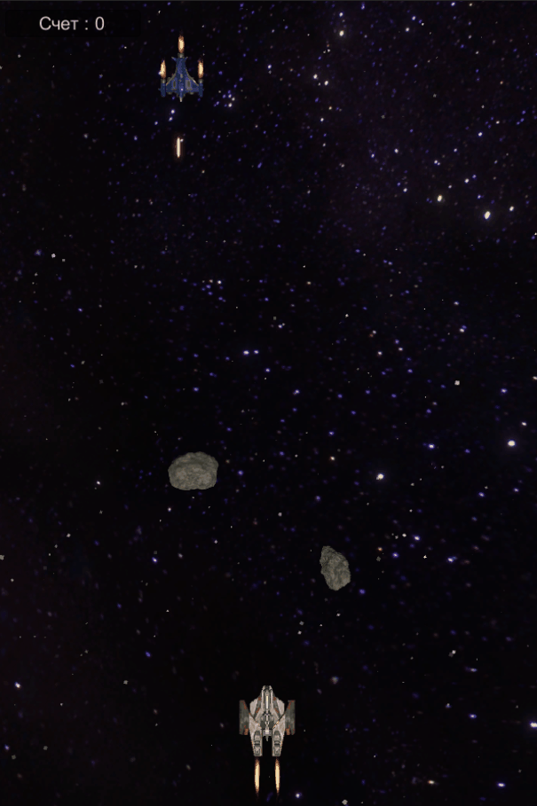

)

+ **Год выпуска: 2022**
+ **Жанр: Космический шутер**
+ **Платформа: PC Win 10**
+ **Тип изданий: Open Source**
___
 **Аркада.** 
___
### Авторы:
+ [**© Присяжных Сергей\(Sergey-Prisyzhnykh-IT\)**](https://github.com/Sergey-Prisyzhnykh-IT)
___
### Процесс игры:

___
### Правила Игры :
+ Игра на одного
+ Игрок управляет космическим кораблем, на левую кнопку мыши происходит выстрел, на правую Fire ball. Игрока могут уничтожить астеройды или космические корабли врага. Враг стреляет и маневрирует на поле. 
+ Для запуска необходимо скачать архив и запустить space shoter.exe
+ Игра написанна на движке Unity 

